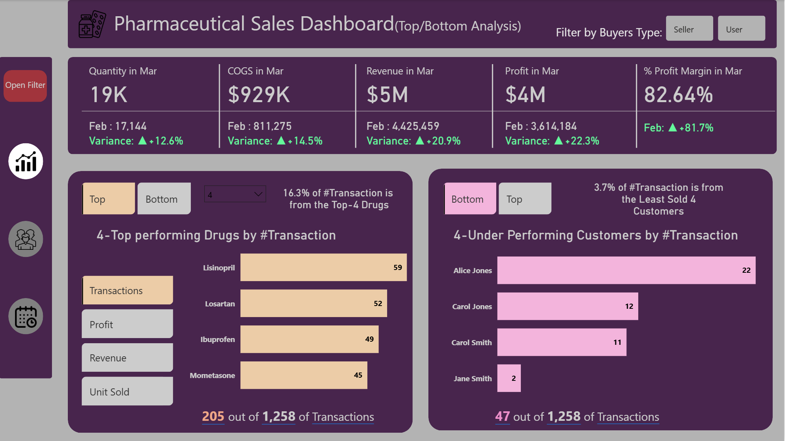
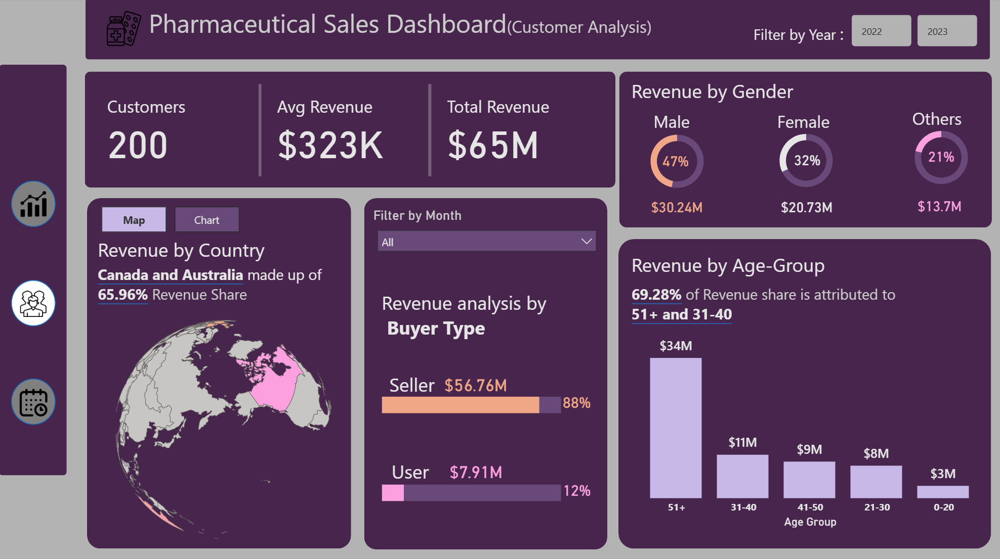
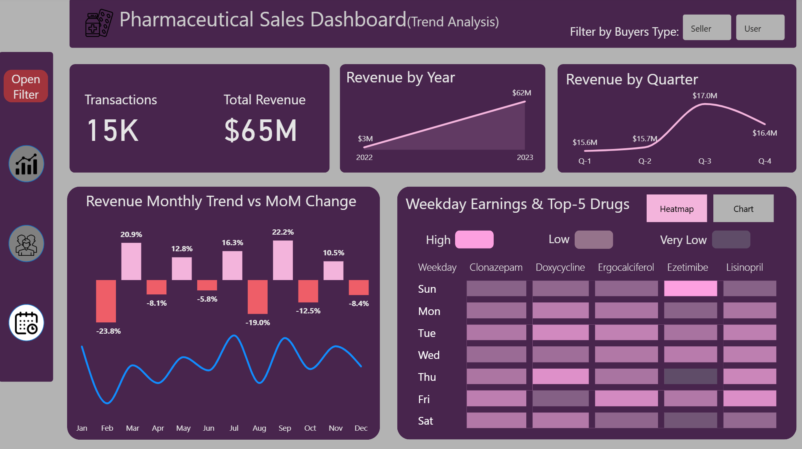

## 💊 Pharmaceutical Sales Dashboard

**Power BI Interactive Dashboard for Pharmaceutical Sales Analysis**

### ⚠️ Problem Statement
The pharmaceutical company faced challenges in monitoring drug sales performance, identifying high and low-performing products and customers, tracking revenue trends, and understanding customer demographics across multiple countries. Lack of consolidated insights made it difficult to optimize sales strategy and improve profitability.

### 🎯 Project Objective
To develop an interactive Power BI dashboard that provides clear visibility into sales data, highlights top and under-performing drugs and customers, analyzes revenue by demographics and geography, tracks monthly trends with MoM changes, and delivers actionable insights to support data-driven decision making.

### 📁 Dataset Overview
The project uses a star schema data model consisting of four tables:

- **FactTable**: Central fact table with 16,314 sales records containing SaleID, DrugID, CustomerID, UnitsSold, BuyerType (Seller/User), and FixedDate.
- **DrugLookup**: Drug dimension table with DrugID, DrugName, UnitSalesPrice, CostOfProduction, and RegulatoryComplianceID (≈40 drugs).
- **CustomerTable**: Customer dimension with CustomerID, FullName, Age, Age Group, Country, and Gender (majority in 51+ age group).
- **Calendar**: Dynamic date table created using DAX (`CALENDARAUTO()`) with Year, Month, Quarter, Weekday, and other time attributes.

**Relationships**: One-to-many active relationships from FactTable to DrugLookup (DrugID), CustomerTable (CustomerID), and Calendar (FixedDate).

### 🔄 Workflow
1. Data ingestion and transformation using Power Query.
2. Creation of star schema data model with proper relationships.
3. Development of a dynamic Calendar table using DAX.
4. Building key DAX measures for Revenue, COGS, Profit, Profit Margin, MoM variance, Top/Bottom rankings.
5. Design of four interactive report pages with slicers, toggles, and tooltips.

### 📊 Dashboard Preview

**1. Top/Bottom Analysis Page**

**2. Customer Analysis**

**3. Trend Analysis**

**4. Tooltip Support**: Detailed drug-level insights for age groups and countries.

> Additional detailed screenshots of tooltips and Data Model(Relationships) are available in the [`/images`](images/) folder.

### 💡 Key Business Insights Delivered
- Total revenue reached **$65M**, with strong growth from 2022 ($3M) to 2023 ($62M).
- Canada and Australia together contribute **~66%** of total revenue.
- **88%** of revenue comes from "Seller" buyer type.
- Top 5 drugs account for **19.3%** of total transactions.
- **69.28%** of revenue is driven by 51+ and 31-40 age groups.
- Friday records the highest weekday sales; Q3 shows quarterly peak.
- Profit margin consistently above **81%** across months.

### 🛠️ Tech Stack
- **Power BI Desktop** — Report development and publishing
- **DAX** — Advanced measures for calculations and time intelligence
- **Power Query** — Data loading and transformation
- **Data Visualization** — KPI cards, bar charts, donut charts, line charts, heatmaps, and map visuals

### Demo Video
For a complete walkthrough of the dashboard, including tooltips, bookmarks, DAX measures, and page navigation, please watch the demo video on LinkedIn :
▶️ [Watch Demo Video on LinkedIn](https://www.linkedin.com/feed/update/urn:li:activity:7443207880583028736/?originTrackingId=s%2F27wGqFQwoAQY%2F15HF7ug%3D%3D)

For any questions or further clarification, fell free to reach out!
